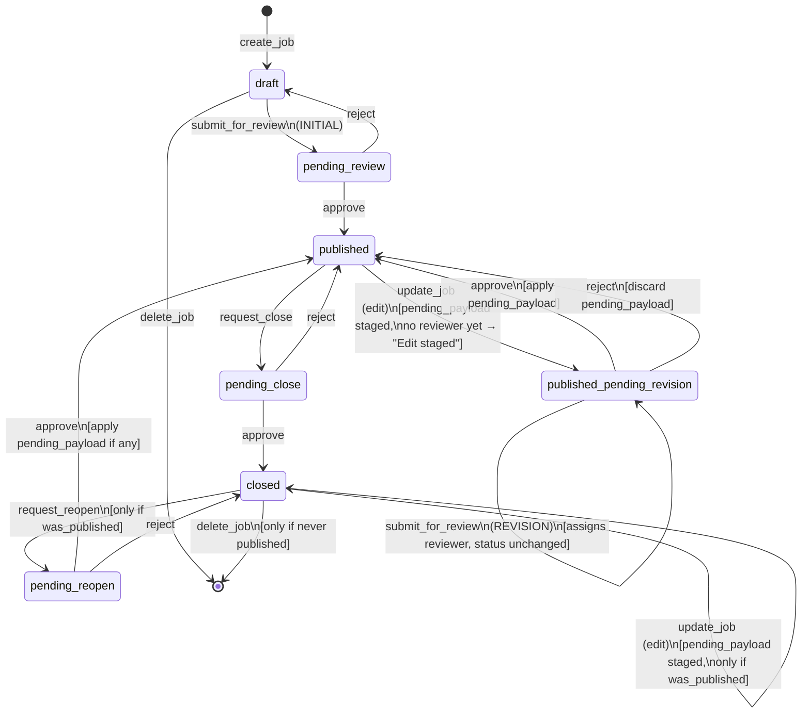

# Job posting status flow (`JobStatus`)

Source of truth: `backend/recruiting/job_service.py` (`submit_for_review`,
`request_close`, `request_reopen`, `approve`, `reject`, `update_job`,
`delete_job`). Frontend badge logic in `PostingsList.jsx` /
`PostingDetailPage.jsx` mirrors this 1:1.

## Notes

- **`staged` / "Edit staged" badge**: true only when
  `status === published_pending_revision && reviewerId == null` — i.e. an
  edit was parked into `pending_payload` by `update_job` but hasn't been
  submitted for a REVISION review yet. Once `submit_for_review` assigns a
  reviewer, the badge shows the real status ("Revision pending review")
  instead.
- **`published_pending_revision` is a no-status-change submission**:
  submitting the staged edit for review does *not* move the job out of
  `published_pending_revision` — the live version stays public throughout.
- **CLOSED editing does not change status**: unlike PUBLISHED, editing a
  CLOSED posting stores `pending_payload` but leaves `status = closed`.
  That payload only gets applied later, on REOPEN approval.
- **Locked once left DRAFT**: `kind` / `mentorship_role` cannot change
  after the first submission.
- **One open review per job** at a time; submitter can never be their own
  reviewer.
- **Deletion is not a status transition** — only a `draft`, or a `closed`
  posting with `was_published == False`, may be deleted. Anything that
  was ever published can never be deleted, regardless of current status.

## Editable-from / action-from matrix

| Current status | `update_job` (edit) | `submit_for_review` | `request_close` | `request_reopen` | `delete_job` |
|---|---|---|---|---|---|
| `draft` | ✅ direct write | ✅ (INITIAL) | ❌ | ❌ | ✅ |
| `pending_review` | ❌ | ❌ | ❌ | ❌ | ❌ |
| `published` | ✅ → stages revision | ❌ | ✅ | ❌ | ❌ |
| `published_pending_revision` | ❌ | ✅ (REVISION) | ❌ | ❌ | ❌ |
| `pending_close` | ❌ | ❌ | ❌ | ❌ | ❌ |
| `closed` | ✅ stages reopen-edit (if `was_published`) | ❌ | ❌ | ✅ (if `was_published`) | ✅ (if never published) |
| `pending_reopen` | ❌ | ❌ | ❌ | ❌ | ❌ |
